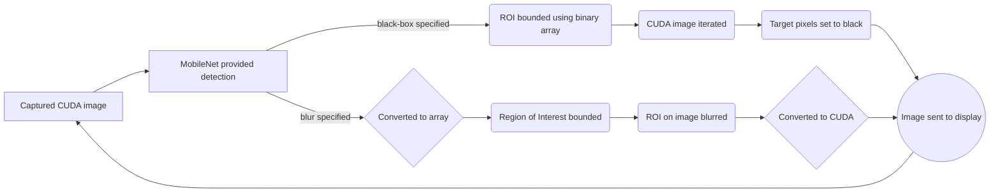



# FACE

FACE (Facial Automatic Censorship) is a program that detects faces from a camera feed and applies a blurred region in order to conceal the person's identity.

This program was created with the purpose of protecting the privacy of individuals who do not wish or can not be legally recorded.  Examples of its usage could be in recording of public spaces or for footage of suspects. The program could also be more generally used as a safety barrier to protect someone's face from leaking in a video.


## The Algorithm

The program uses the MobileNet-SSD model, re-trained using the OpenImages dataset, which is specialised to detect the head region of a person. 
Here is a flow chart of the general algorithm used:

If you happened to find yourself lost two steps in, that is completely expected. Do not worry, as the algorithm will be explained in more detail.

This program uses Mobilenet-SSD to provide the bounding box coordinate of the detected head region right after the image is captured.

Afterwards, for every detection found, the program runs a function called censor_img() and you will never guess what it does; depending on the specified argument "censor-type", a different algorithm is preformed to censor the detected region. 

First, we'll start with "blur":

1. Before being able to perform CV2 operations on the image, the CUDA format must first be converted into a Numpy array. This is done through creating a creating an empty CUDA image in the 'bgr8' format and copying the colors from the original (as CV2 uses the BGR color scheme.) A function is then ran to convert the BGR image into a Numpy array.

2. The top left coordinate is then defined which, along with the width and height provided with the detection, is enough to bound a region of interest around the detected area.

3. If the ROI ends up being larger than nothing, this ROI is then blurred using the CV2 GuassianBlur function and applied to the image.

4. The Numpy array is converted back to a CUDA image and sent to display.

Alternatively, "black-box" can be chosen:

1. This will create a Numpy array copy of the CUDA shape with 0s for every value, and then create another with 1s with the shape of the detected region. The desired region of the 0 array is then replaced with the 1 array, essentially creating a ROI denoted by 1s.

2. The x, y values are iterated through the CUDA image and, if the corresponding coordinate of the ROI is a 1, then all 3 color channels of the CUDA image get converted to 255, changing the pixel to black.
3. The CUDA image is sent to display.


## Running this project

You will need to install OpenCV using pip for this program to run:
```python
pip3 install opencv-python
```

1. Place the program files in a new directory of your choice.
2. CD using the terminal into the new directory with the program files.
3. Before running the command, you should know the arguments avaliable:
```--censor-type``` {method for covering face, "blur" or "black-box"} (default="blur")
```--source``` {video stream source} (default="/dev/video0")
```--output ``` {output for the video stream} (default="display://0")

4. Run the command (including optional arguments) shown below:
 ```python
python3 main.py
```


[View a video explanation here](https://www.youtube.com/watch?v=9Sv6OHulzJE&feature=youtu.be)
